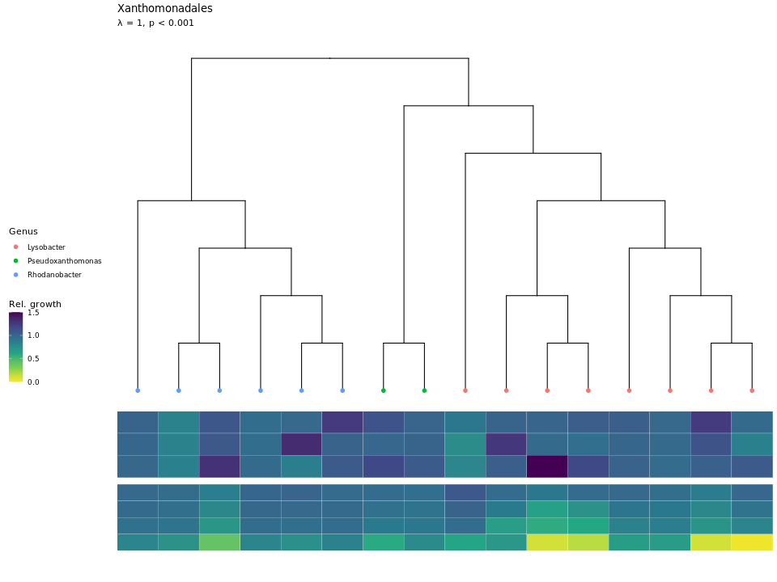
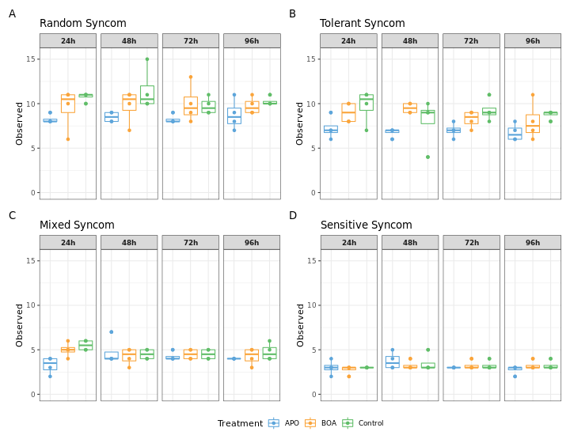
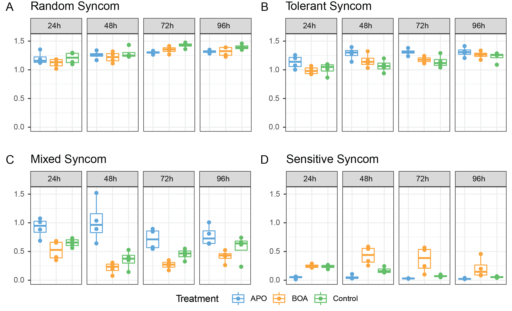
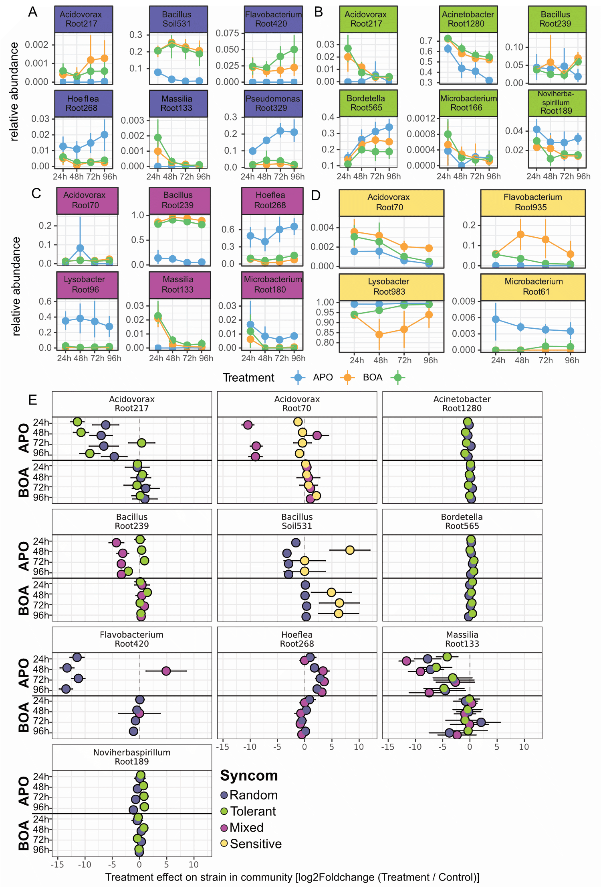

\newpage

```{r include=F, message=FALSE}
library(magrittr)
```

# Tables

## Table S1. Phylogenetic signal lambda

```{r echo=F}
readr::read_rds("files_publication/TabSupp_lambda.rds") %>% 
  gt::as_latex()
```

\newpage

## Table S2. Syncom strains

```{r echo =F}
readr::read_rds("files_publication/syncom_membership.rds") %>% 
  dplyr::group_by(Syncom) %>% 
  dplyr::arrange(Genus) %>% 
  gt::gt() %>% 
  gt::as_latex()
```


\newpage

## Table S3. PERMANOVA

```{r echo=F}
readr::read_rds("files_publication/TabS3_permanova_gt.rds") %>% 
  gt::as_latex()
```

\newpage

## Table S4. PERMANOVA comparing only two treatments

```{r echo = F}
readr::read_rds("files_publication/TabS4_PERMANOVA_per_treatment_gt.rds") %>% 
  gt::as_latex()
```

\newpage

## Table S5. ANOVA: Observed taxa

```{r echo=F}
readr::read_rds("files_publication/TabS5_AOV_observed.rds") %>% 
  gt::as_latex()
```

\newpage

## Table S6. Observed diversity means and pairwise comparisons

```{r echo=F}
readr::read_rds("files_publication/TabS6_overserved_pairwise.rds")  %>% 
  gt::as_latex()
```

\newpage

## Table S7. ANOVA: Shannon Diversity

```{r echo=F}
readr::read_rds("files_publication/TabS7_AOV_shannon.rds") %>% 
  gt::as_latex()
```

\newpage

## Table S8. Shannon diversity means and pairwise comparisons

```{r echo=F}
readr::read_rds("files_publication/TabS8_shannon_pairwise.rds") %>% 
  gt::as_latex()
```

\newpage

## Table S9. Correlation between change in relative abundance and change in growth

```{r echo =F}
readr::read_rds("files_publication/rsquare_l2FC_AUC.rds") %>%
  dplyr::arrange(AUC) %>% 
  dplyr::mutate(AUC = dplyr::case_when(AUC == "abs" ~ "log2FC vs absolute AUC",
                         AUC == "rel" ~ "log2FC vs relative AUC")) %>% 
  dplyr::group_by(AUC) %>% 
  gt::gt() %>% 
  gt::as_latex()
```

\newpage

# Figures

## Supplemental Figure S1


**Supplemental Figure S1. Bx sensitivity of Xanthomonadales.** Genera belonging to the Order Xanthomonadales are plotted. The tree was constructed from concatenated sequences (see methods). The upper 3 rows of the heatmap display relative growth in 10µM, 50µM and 100µM BOA (top to bottom), the lower four rows of the heatmap relative growth in medium supplemented with 1µM, 5µM, 10µM and 50µM APO.

## Supplemental Figure S2


**Supplemental Figure S2. Observed alpha diversity.** The number of observed bacterial genera of the samples belonging to the four different syncoms (**A-D**) is shown for each time point (facet) and treatment (color). Each sample is plotted as a dot, and box-and-whisker plots show the summary statistics for each treatment / time point combination. \newpage

## Supplemental Figure S3


**Supplemental Figure S3. Shannon diversity indices of the synthetic communities.** The Shannon indices of the samples belonging to the four different syncoms (*A-D*) are shown for each time point (facet) and treatment (color). Each sample is plotted as a dot, and box-and-whisker plots show the summary statistics for each treatment / time point combination.

## Supplemental Figure S4



**Supplemental Figure S4. Changes in relative abundance by community.**
**A-D** The relative abundance over time for different isolates that showed signficant differences in relative abundance at at least one timepoint (compared to control). Relative abundance is shown per treatment and timepoint, errorbars indicate 95% CI. **E** Changes in relative abundance per treatment and timepoint for isolates that were found in more than one community. Errorbars indicate s.e. of the log2Foldchange.
