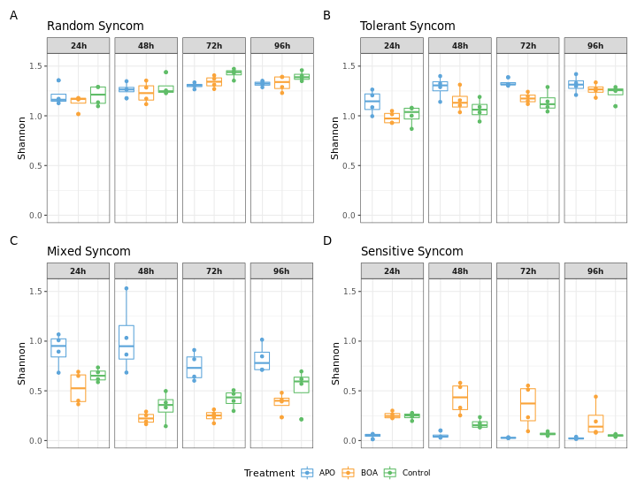

\newpage

```{r include=F, message=FALSE}
library(magrittr)
```

# Tables

## Table S1. Syncom strains

```{r echo =F}
readr::read_rds("files_publication/syncom_membership.rds") %>% 
  dplyr::group_by(Syncom) %>% 
  dplyr::arrange(Genus) %>% 
  gt::gt() %>% 
  gt::as_latex()
```

\newpage

## Table S2. PERMANOVA

```{r echo=F}
readr::read_rds("files_publication/TabS2_permanova_gt.rds") %>% 
  gt::as_latex()
```

\newpage

## Table S3. PERMANOVA comparing only two treatments

```{r echo = F}
readr::read_rds("files_publication/TabS3_PERMANOVA_per_treatment_gt.rds") %>% 
  gt::as_latex()
```

\newpage

## Table S4. ANOVA: Observed taxa

```{r echo=F}
readr::read_rds("files_publication/TabS4_AOV_observed.rds") %>% 
  gt::as_latex()
```

\newpage

## Table S5. Observed diversity means and pairwise comparisons

```{r echo=F}
readr::read_rds("files_publication/TabS5_overserved_pairwise.rds")  %>% 
  gt::as_latex()
```

\newpage

## Table S6. ANOVA: Shannon Diversity

```{r echo=F}
readr::read_rds("files_publication/TabS6_AOV_shannon.rds") %>% 
  gt::as_latex()
```

\newpage

## Table S7. Shannon diversity means and pairwise comparisons

```{r echo=F}
readr::read_rds("files_publication/TabS7_shannon_pairwise.rds") %>% 
  gt::as_latex()
```

# Figures

## Supplemental Figure 1


**Supplemental Figure 1. Observed alpha diversity.** The number of observed bacterial genera of the samples belonging to the four different syncoms (**A-D**) is shown for each time point (facet) and treatment (color). Each sample is plotted as a dot, and box-and-whisker plots show the summary statistics for each treatment / time point combination.

\newpage

## Supplemental Figure 2


**Supplemental Figure 2. Shannon diversity indices of the synthetic communities.** The Shannon indices of the samples belonging to the four different syncoms (*A-D*) are shown for each time point (facet) and treatment (color). Each sample is plotted as a dot, and box-and-whisker plots show the summary statistics for each treatment / time point combination.

\newpage

## Supplemental Figure 3


**Supplemental Figure 3. Correlation networks.** Networks of isolate Pearson’s correlations in the random **(A)** and tolerant **(B)** syncom. Each individual plot shows correlations between isolates for one time point and treatment combination. The color of each edge indicates the strength, and sign of the correlation (blue: negative correlation; yellow: positive) and each node represents one isolate. The background color of the node label indicates whether an isolate was part of both communities (white) or only included in one (gray). Only correlations where |r| > 0.5 were included.